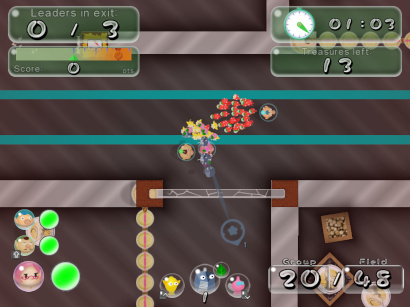
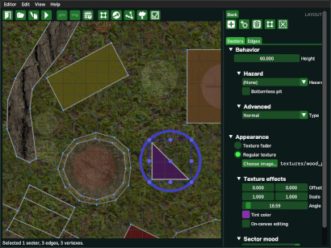

 _Pikifen_, a _Pikmin_-based game/engine for fan-made content.  
Made with ♡ by Espyo.

> **[⤓ Download for Windows! ⤓](#get-the-latest-version)**

---
 

> * [Overview](#overview)
> * [Playing and making](#playing-and-making)
> * [Notable features](#notable-features)
> * [Get the latest version](#get-the-latest-version)
> * [Roadmap](#roadmap)
> * [Troubleshooting](#troubleshooting)
> * [Repository](#repository)
> * [Disclaimer](#disclaimer)

On top of this readme, the included manual (download _Pikifen_ and open `manual.html`) contains tutorials, the changelog, troubleshooting information, compilation instructions, an FAQ, credits, and more!

## Overview

* **_Pikifen_** (formerly Pikmin fangame engine) is a game and engine capable of creating and playing _Pikmin_ fan content. Think of it like a "_Pikmin [Maker](https://www.mariowiki.com/Super_Mario_Maker)_".
* It's a simplified take on the _Pikmin_ games, even being in a 2D [orthographic](https://en.wikipedia.org/wiki/Orthographic_projection) top-down view, but is still very powerful and jam-packed with features.
* The idea is for fans to create their own content (enemies, areas, etc.), while the engine itself handles the game logic (physics, scripting, etc.). Still, it comes with some base content so you can experiment with its features right away.
* It's available for Windows, Linux, and Mac, and you can use a keyboard, mouse, and/or controller.
* This project is under constant development, so expect some things to be incomplete! Some things may also be different from the canon games because it's simpler, better for the engine's flexibility, or impossible to fully replicate.

## Playing and making

* To play...
  * Just double-click `pikifen.exe` (if you can't find it, make sure you followed [the instructions](#get-the-latest-version)), then pick an area and start playing!
  * While it has no Story Mode support, it has missions, which give you a medal based on your performance!
* To make content...
  * Just edit the image, sound, or text files in the `game_data` folder. Some things can also be edited using the built-in editors.
  * Alternatively, you can download some content made by other players (check the [Discord server](https://discord.gg/qbhz4u3)!)
* For more detailed information, including tutorials, please check the included manual.

## Notable features

### Feature-rich

* Replicates most of the standard _Pikmin_ gameplay.
* Implements some of the more complex features, such as dynamic music or Go Here!
* Unique features like status effects, weather conditions, elaborate missions, and more.
* A handful of pre-packaged content to play with right away.

### Powerful content editing

* Content that can be customized simply by editing its files.
* Intuitive and deep editors, for areas, animations, particles, and the GUI. (Made with [Dear ImGui](https://github.com/ocornut/imgui)!)
* Scripting for objects using [finite-state machines](https://en.wikipedia.org/wiki/Finite-state_machine) and a custom scripting language.

### Content-making utilities

* A pack system, designed to make sharing custom content easy.
* Tools to help with debugging custom content.
* A comprehensive but easy-to-follow manual to help with making content.

### Polish

* Highly-customizable control schemes.
* Filled with quality-of-life features and details, both for gameplay and for content-making.
* Fairly low system requirements, 60FPS, no special permissions to run, no need to install, and less than 100 MB when extracted.

### Open-source friendly

* Made almost entirely from scratch (with [Allegro](https://github.com/liballeg/allegro5)!), as free and open-source software, for Windows, Linux (Steam Deck too!), and Mac.
* Made almost exclusively using free and open-source software, and no generative AI.
* Organized codebase with very few external dependencies.
* The source "code" for some of the graphics and songs is also available.

### [Accessible Games Initiative](https://accessiblegames.com/accessibility-tags/) tags

* Auditory features:
  * [Multiple Volume Controls](https://accessiblegames.com/accessibility-tags/multiple-volume-controls/)
* Input features:
  * [Full Input Remapping](https://accessiblegames.com/accessibility-tags/full-remapping/), [Playable with Buttons Only](https://accessiblegames.com/accessibility-tags/buttons-only-option/), [Playable with Keyboard Only](https://accessiblegames.com/accessibility-tags/keyboard-only-option/), [Playable with Mouse Only](https://accessiblegames.com/accessibility-tags/mouse-only-option/), [Playable without Button Holds](https://accessiblegames.com/accessibility-tags/playable-without-button-holds/), [Stick Inversion](https://accessiblegames.com/accessibility-tags/stick-inversion/)
* Visual features:
  * [Camera Comfort](https://accessiblegames.com/accessibility-tags/camera-comfort/)

## Get the latest version

### Upgrading from an older version

* If you are upgrading from an older version of _Pikifen_, you should extract it into a new folder and use that one instead.
* If you care about your settings, records, and personal backups, copy over the `user_data` folder from the previous version as well.
* If you have any custom-made content you want to keep, copy that too, and remember to also follow any instructions noted in the changelog, inside the included manual.
* If you just extract the new version into the same folder as the old one, you risk having files you care about be replaced, as well as keeping old files that the new version doesn't use and end up wasting space.

### Windows

* The latest version available for download for Windows is shown at the top of the [GitHub releases page](https://github.com/Espyo/Pikifen/releases). Open the "Assets" list, then click the `Pikifen_***.zip` file for that version.
* Once downloaded, just unzip the downloaded zip file onto a folder, and double-click `pikifen.exe` inside to start running.
* If you can't find any `pikifen.exe` file to double-click, then check if there's a `source` folder. If there is, you've downloaded the wrong zip file.
* Alternatively, if you're experienced, you can download the source code and compile it to get the most up-to-date features. Compilation instructions can be found in the included manual.
        
### Linux and Mac

* In order to play on Linux or Mac, you can build it from the source code. A simple tutorial on how to compile the engine can be found in the included manual.
* Alternatively, you can run the [Windows executable](#windows) under [Wine](https://en.wikipedia.org/wiki/Wine_(software)). It works fairly well, though if you run into issues, check the included manual's "Troubleshooting" page.

## Roadmap

* To know what still needs to be done in the project, please check:
  * The included manual's "History" page for a general overview.
  * The project's [todo file](https://github.com/Espyo/Pikifen/blob/master/source/documents/todo.txt) for details.

## Troubleshooting

* If you have any issue, please check the included manual's "Troubleshooting" and "FAQ" pages.

## Repository

  

* For information on how to contribute, please see the [contributing file](https://github.com/Espyo/Pikifen/blob/master/contributing.md).

## Disclaimer

Project licensing info can be found in `license.txt`.
    
Trademark and copyright of _Pikmin_ belongs to Nintendo.  
_Pikifen_ and any fan content run within it are not affiliated with Nintendo, do not replace any official Nintendo content, do not contain any copyrighted assets, and can not be sold.  
They are non-commercial projects created by fans of the _Pikmin_ franchise for entertainment and educational purposes only.
